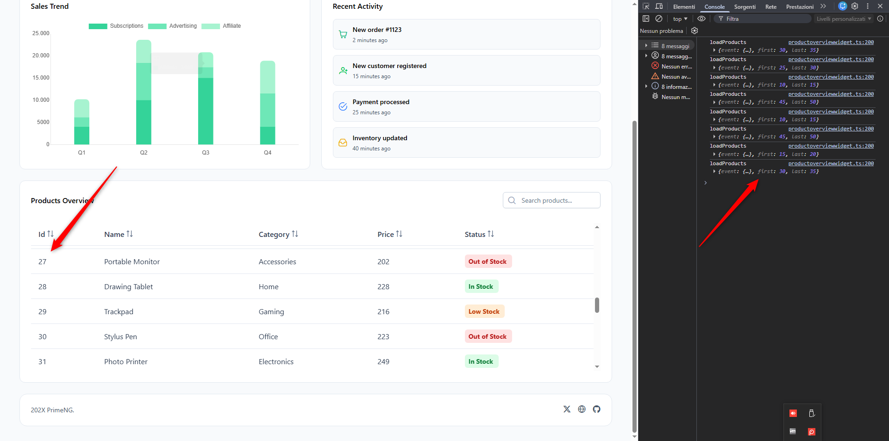

# PrimeNG - Table - Virtual Scroll

**Description**  
This is a minimal sample project created to reproduce an issue with the PrimeNG Table component when using virtual scroll.  
The problem is that the displayed row index does not correspond to the actual record number shown in the grid.

**Screenshot**  

**Steps to Reproduce**
1. Run the sample project.
2. Open the page containing the virtual scroll table.
3. Scroll through the rows.
4. Observe that the index shown in the table does not match the actual record number.

**Expected Behavior**  
The index displayed in each row should correctly reflect the corresponding record number.

**Actual Behavior**  
The index is inconsistent and does not match the actual record rendered in the grid.

**Environment**  
- PrimeNG version:  
21